<p align="center">
  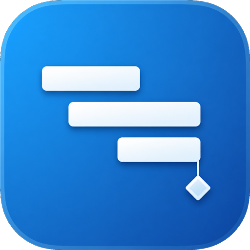
</p>

<h1 align="center">📊 SuperGantt</h1>

<p align="center">
  <strong>A modern project planner that speaks Microsoft Project</strong><br/>
  — without the license, the ribbon maze, or the “save as XML and pray” ritual.
</p>

<p align="center">
  <a href="https://github.com/yeswolf/supergannt/releases/latest"></a>
  <a href="https://github.com/yeswolf/supergannt/releases/latest"></a>
  <a href="#-quick-start"></a>
  <a href="#-license--trademarks"></a>
</p>

<p align="center">
  <a href="#-screenshots">📸 Screenshots</a> ·
  <a href="#-features">✨ Features</a> ·
  <a href="#-quick-start">🚀 Quick start</a> ·
  <a href="https://github.com/yeswolf/supergannt/releases/latest">💿 Download</a>
</p>

---

Open real **`.mpp`** plans. Edit them in the browser, on the Windows desktop, or on **Android**. Schedule like ProjectLibre. Save back as `.mpp`, MSPDI XML, MPX, or PDF — including **fully offline** on the phone.

Built for people who live in Gantt charts — PMs, schedulers, and engineers who want a **fast local tool** that still interoperates with **Microsoft Project** and **ProjectLibre**.

---

## 📸 Screenshots

Sample plan: [`06-advanced-tracking.mpp`](testdata/mpp/06-advanced-tracking.mpp)  
*(screenshots omit recurring “Editorial staff meeting” tasks for clarity)*

<details open>
<summary>📅 Gantt Chart — week scale (Light)</summary>
<p align="center">
  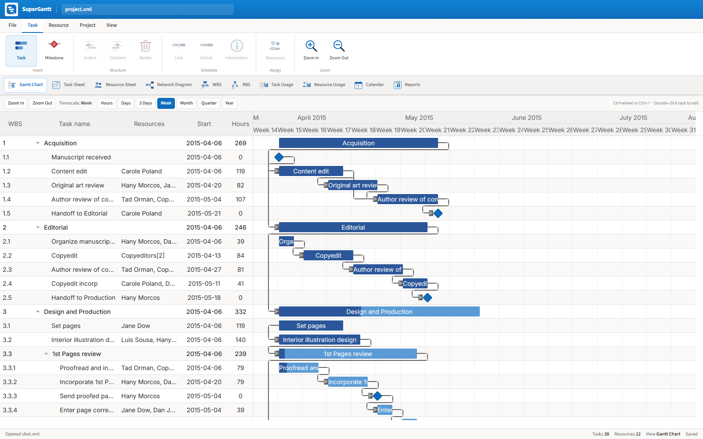
</p>
</details>

<details>
<summary>🎨 Gantt — Dark</summary>
<p align="center">
  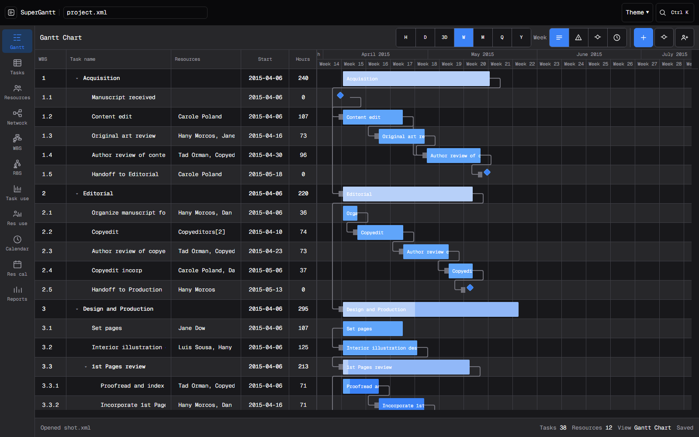
</p>
</details>

<details>
<summary>🎨 Gantt — Darcula</summary>
<p align="center">
  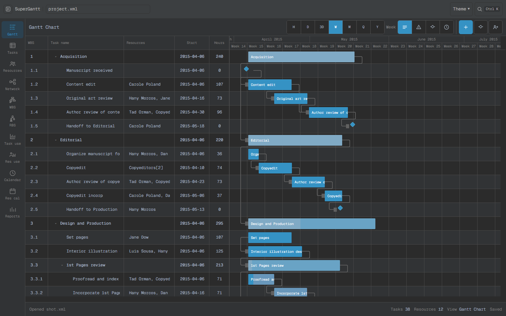
</p>
</details>

<details>
<summary>🎨 Gantt — Solarized Dark</summary>
<p align="center">
  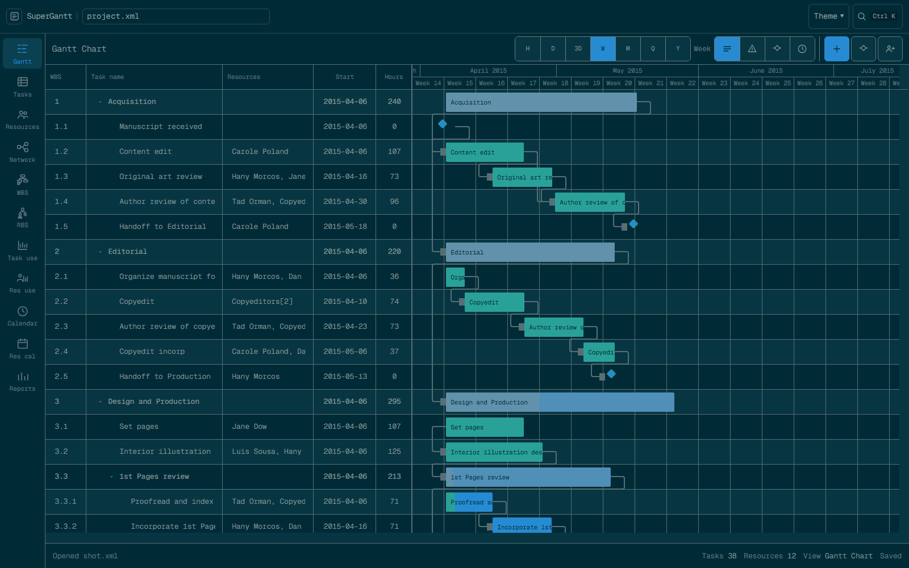
</p>
</details>

<details>
<summary>🗓️ Gantt Chart — month scale</summary>
<p align="center">
  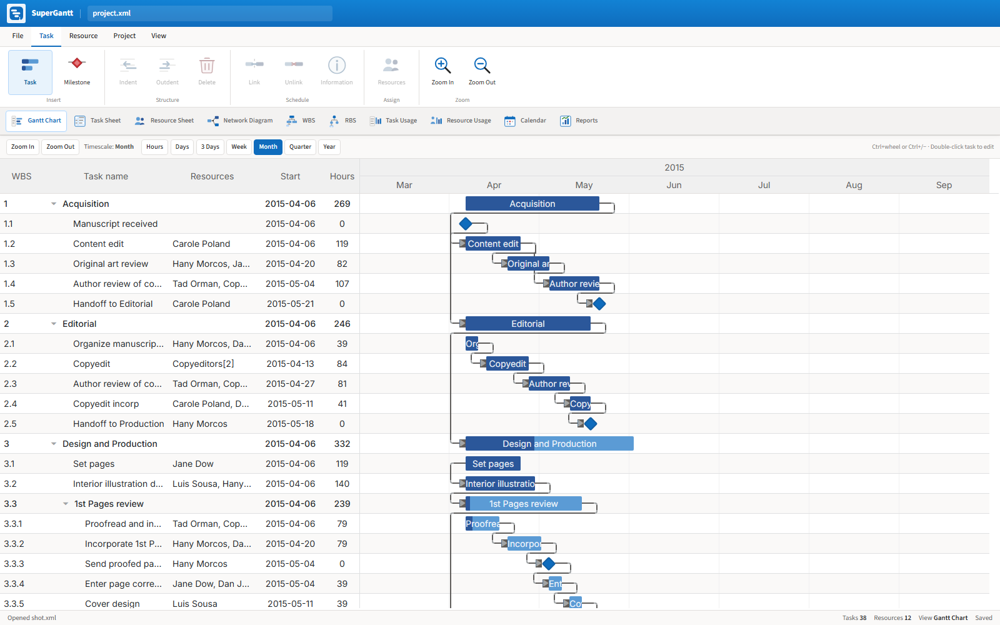
</p>
</details>

<details>
<summary>📋 Task Sheet</summary>
<p align="center">
  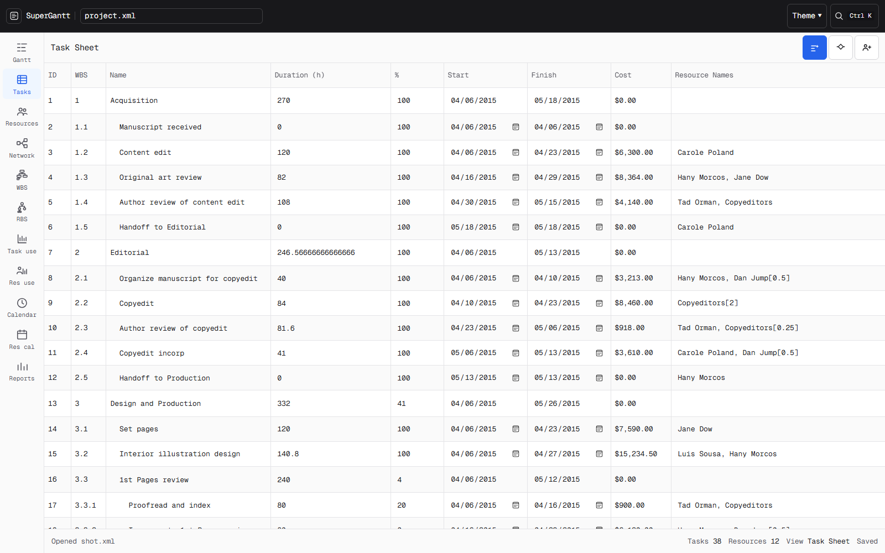
</p>
</details>

<details>
<summary>👥 Resource Sheet</summary>
<p align="center">
  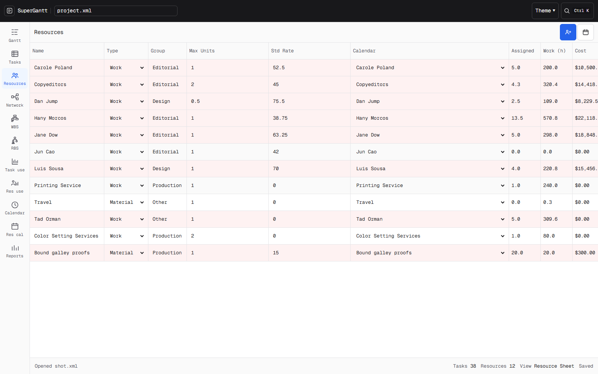
</p>
</details>

<details>
<summary>🕸️ Network Diagram</summary>
<p align="center">
  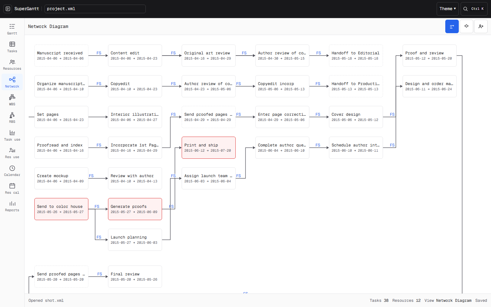
</p>
</details>

<details>
<summary>🌳 WBS</summary>
<p align="center">
  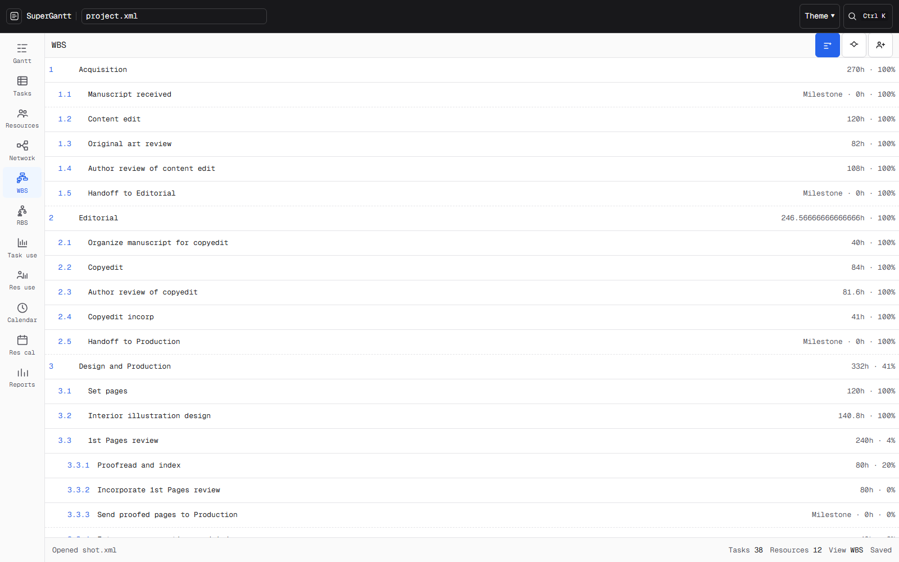
</p>
</details>

<details>
<summary>⏱️ Task Usage</summary>
<p align="center">
  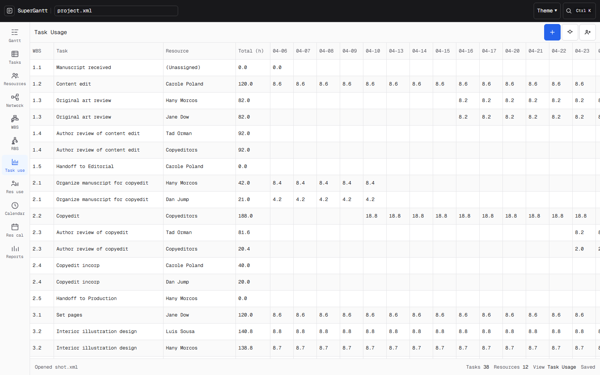
</p>
</details>

<details>
<summary>📈 Resource Usage</summary>
<p align="center">
  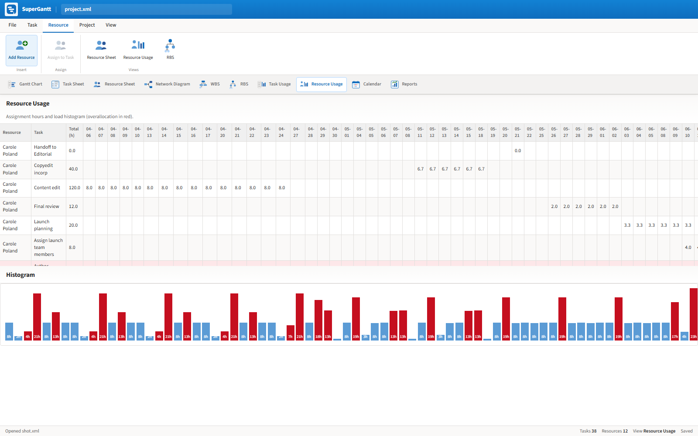
</p>
</details>

<details>
<summary>📆 Working Time</summary>
<p align="center">
  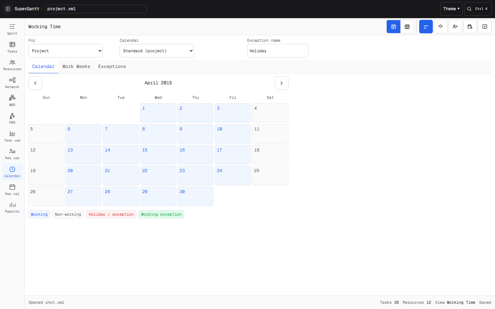
</p>
</details>

<details>
<summary>📑 Reports</summary>
<p align="center">
  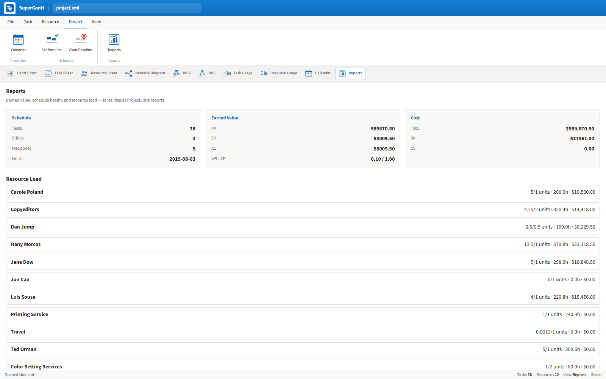
</p>
</details>

---

## ✨ Features

| | |
|:--|:--|
| 📂 | **Open binary `.mpp` / `.mpt`** — the same files Project opens |
| ✏️ | **Edit** tasks, dates, duration, % complete, WBS, predecessors (`2FS+8h`), resources & assignments |
| 🧠 | **Schedule** ASAP with FS / SS / FF / SF, lag/lead, constraints, critical path & baselines |
| 💾 | **Save** as native **`.mpp`**, MSPDI **`.xml`**, **`.mpx`**, or **PDF** |
| 🖥️ | **Browser** or **Windows desktop** (Tauri / WebView2) |
| 📱 | **Android** APK — offline open/save of `.mpp`, XML, MPX, PDF (no cloud) |
| 🎨 | **Themes** — Light, Dark, Contrast, Darcula, Solarized |
| ⌨️ | **Command palette** (Ctrl+K) for file actions + commands |
| 🐳 | Fully offline with **Docker** |

**Views:** Gantt · Task Sheet · Resources · Network · WBS · Usage · Calendars · Reports (incl. earned-value style summaries)

---

## 🚀 Quick start

```bash
npm install
npm run mpp:setup    # once — JDK 17+ + MPP converter JAR
npm run dev
```

Then open **http://localhost:5173** 🎉

| Command | What it does |
|---------|----------------|
| `npm run dev` | 🌐 Web UI + MPP API |
| `npm run tauri:pack` | 📦 Windows installer → `release-tauri/` |
| `npm run android:build` | 📱 Signed arm64 APK → `release-android/` |
| `npm run docker:up` | 🐳 All-in-one container on port **8080** |
| `npm test` | ✅ Unit + integration tests |

### Download installers

Grab **Windows** (`.exe`) and **Android** (`.apk`, arm64) from the [latest GitHub release](https://github.com/yeswolf/supergannt/releases/latest).

| Platform | Artifact | Notes |
|----------|----------|--------|
| Windows x64 | `SuperGantt_*_x64-setup.exe` | NSIS installer (WebView2) |
| Android arm64 | `SuperGantt_*_arm64-v8a.apk` | Offline; saves to phone **Downloads** |

Android build details: [`docs/android-offline.md`](docs/android-offline.md).

> ☕ **Java / MPP (desktop & web):** On first MPP open the app looks for JDK/JRE 17+. If none is found, it downloads **Eclipse Temurin 21 JRE** into the app runtime folder (`server/.runtime` in dev, or `%LOCALAPPDATA%\SuperGantt\runtime` in the desktop build).
>
> For local development you can still run `npm run mpp:setup` once to build `mpp-convert.jar`.
>
> **Android** ships MPXJ inside the APK — no separate JDK on the phone.

---

## 📁 Opening & saving files

| Format | Open | Save | Notes |
|--------|:----:|:----:|-------|
| `.mpp` / `.mpt` | ✅ | ✅ | Real MS Project binary (OLE compound) |
| MSPDI `.xml` | ✅ | ✅ | Best interchange with Project & ProjectLibre |
| `.mpx` | — | ✅ | Legacy exchange |
| PDF | — | ✅ | Export snapshot |

💡 **Tip:** If a colleague uses Microsoft Project, MSPDI XML is the safest shared format. SuperGantt can also write `.mpp` for round-trips and native Project files when you need them.

Unchanged plans save **byte-identical** to the `.mpp` you opened. After you edit, SuperGantt rewrites the schedule into a Project-style OLE file.

---

## 🧭 Scheduling, the ProjectLibre way

SuperGantt follows the same mental model as ProjectLibre / MS Project:

- 🕐 Working-time calendars (not naive calendar days)
- 🔗 Predecessors with type + lag (`3SS-4h`)
- 📌 **Start No Earlier Than** when you drag a bar or set a start date
- 📊 Summary tasks roll up from children
- 🔥 Critical path from zero total float

Edit **Start** and **Finish** in the Task Sheet or Task Information dialog — duration recalculates in working hours when you change Finish.

---

## 📚 References & inspiration

| Reference | Role |
|-----------|------|
| **[Microsoft Project](https://www.microsoft.com/microsoft-365/project)** | UX & file-format north star (`.mpp`, MSPDI, constraints, WBS) |
| **[ProjectLibre](https://www.projectlibre.com/)** | Open-source scheduling model we deliberately mirror |
| **[MPXJ](https://www.mpxj.org/)** | Industry-standard read path ([FAQ](https://www.mpxj.org/faq/)) |
| **[DHTMLX Gantt](https://dhtmlx.com/docs/products/dhtmlxGantt/)** | Interactive Gantt in the UI |
| **MSPDI** | Official XML interchange Project & ProjectLibre already share |
| **OLE Compound Document** | Container format used by classic `.mpp` |

### 🧪 Sample plans used in tests

Integration tests open **10 real `.mpp` files**, not toy stubs:

- Practice files from ***Microsoft Project 2013 Step by Step*** (O’Reilly / Microsoft Press, ISBN [9780735669116](https://resources.oreilly.com/examples/9780735669116-files))
- A **Project Online** export from [MPXJ issue #443](https://github.com/joniles/mpxj/issues/443)

```bash
npm run mpp:fixtures   # re-download fixtures
```

Details: [`testdata/mpp/README.md`](testdata/mpp/README.md).

---

## 🏗️ Architecture (for the curious)

CLEAN layers, no framework spaghetti:

```
src/domain          entities, calendars, scheduling & cost rules
src/application     use cases, ports, project refresh pipeline
src/infrastructure  MSPDI / MPP / MPX codecs, PDF, HTTP converters
src/presentation    React UI, adaptive shell, Gantt, sheets
server/             Hono API — .mpp ↔ MSPDI (Java MPXJ + OLE writer)
```

Coverage gate: **≥ 80%** via Vitest ✅

---

## 🐳 Docker

```bash
docker compose up --build
```

App: **http://localhost:8080** (UI + MPP API + OpenJDK converter).

---

## ⚖️ License & trademarks

SuperGantt is an independent project. **Microsoft Project** is a trademark of Microsoft Corporation. **ProjectLibre**, **MPXJ**, and **DHTMLX** are trademarks of their respective owners. SuperGantt is not affiliated with or endorsed by them.

---

<p align="center">
  <em>📣 Plan loud. Ship quiet. Keep the <code>.mpp</code>.</em>
</p>
